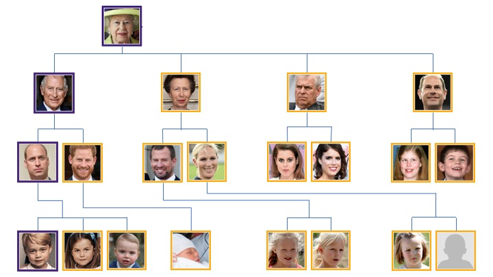
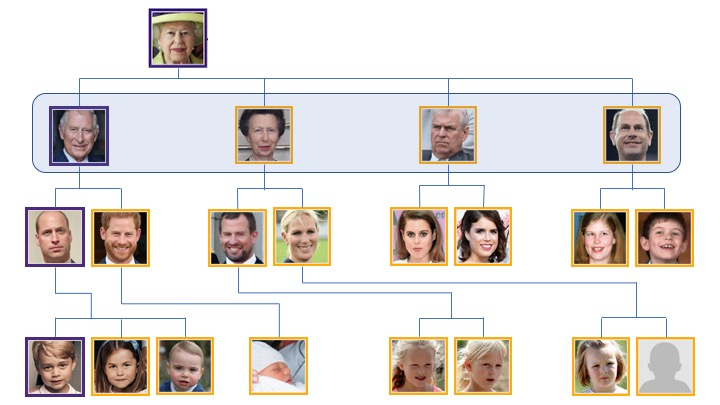
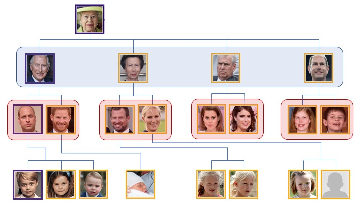
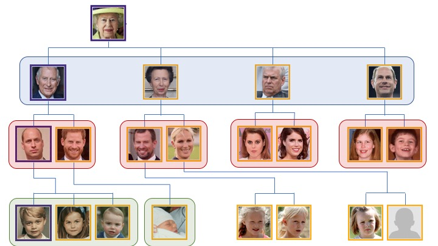
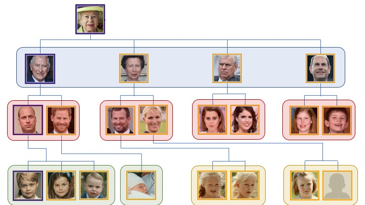

```{r setup, include=FALSE }
knitr::opts_chunk$set(echo = FALSE, message=FALSE, warning=FALSE )


# install.packages('xaringan')


library("ggplot2")
library("dplyr")
library("kableExtra")
library("RefManageR")
library("ggthemes")
library("rnaturalearth")
library("sphereplot")

library("sf")
library("tidyverse")
library("readxl")

library("RRSM")


usepackage_latex <- function(name, options = NULL) {
  invisible(knitr::knit_meta_add(
    list(rmarkdown::latex_dependency(name, options))
  ))
}

usepackage_latex( c("amsmath", "color", "xcolor") )


knitr::knit_meta_add(
    list(
      rmarkdown::latex_dependency("xcolor", NULL)
    )
  )

```


layout: true
border-top: 0px solid #23373B;
background-image: url("pictures/wvu_background.png")
background-position: 50% 50%;
background-size: 100% 100%

.white[
.right[

# Introduction to <br> Spatial Data Analysis

.large[Casey Jelsema | BIOS 604 | ?? Aug 2019]

]
]


```{r, load_refs, include=FALSE, cache=FALSE }
BibOptions(check.entries = FALSE,
           bib.style  = "authoryear",
           cite.style = "alphabetic",
           style      = "markdown",
           hyperlink  = FALSE,
           dashed     = FALSE)
myBib <- ReadBib("spatial_bib.bib", check = FALSE)
```


```{r, load_data, include=FALSE, cache=FALSE }

## Taken from PUBH 311 folder
## May restructure my data eventually


dat_wv <- read_excel( "wv_county_data_2019_joined.xlsx" ) %>%
  dplyr::mutate(
    COUNTYFP = factor( str_sub( fips , 3, 5 ) ),
    pct_fem  = `demographics..%_female`,
    pct_flu  = `flu_vaccinations..%_vaccinated`,
    avg_pm25 = `air_pollution_-_particulate_matter..average_daily_pm2.5`
  ) %>%
  dplyr::select_if( ~ !any(is.na(.) ) ) %>%
  dplyr::select( COUNTYFP, pct_fem, pct_flu, avg_pm25 )

dat_shape <- sf::st_read( dsn = "tl_2009_54_county/tl_2009_54_county.shp" )

dat_wv_shp <- dat_shape %>% 
  left_join( dat_wv )


if( FALSE ){

ggplot( dat_wv_shp ) +
  geom_sf( aes(fill= pct_fem))


colnames(dat_wv)

}


# food_insecurity..#_food_insecure
# life_expectancy..life_expectancy
# diabetes_prevalence..%_diabetic
# physical_inactivity..%_physically_inactive
# 
# adult_obesity..%_obese
# excessive_drinking..%_excessive_drinking
# 
# HIGH
# air_pollution_-_particulate_matter..average_daily_pm2.5
# life_expectancy..life_expectancy
# 
# MEDIUM
# flu_vaccinations..%_vaccinated
# 
# LOW
# driving_alone_to_work..%_drive_alone
# demographics..%_female
# 
# Add Context (big cities / universities)
# some_college..%_some_college


## Read the PM 2.5 data

if( FALSE ){

dat_pm25_01 <- read_csv( "ds.input.aqs.pm25.2016.csv" )
dat_pm25_02 <- dat_pm25_01 %>%
  rename( Latitude = Lat,
          Longitude = Lon ) %>%
  st_as_sf( coords = c("Longitude", "Latitude") , crs=st_crs(dat_shape)  )


dat_in_wv <- st_join( dat_pm25_02, dat_shape, join = st_within ) %>%
  st_drop_geometry() %>%
  left_join( dat_pm25_01 , by=c("Site", "POC", "Date", "Conc" ) )

dat_in_wv <- dat_in_wv %>%
  dplyr::filter(
    Lat < st_bbox(dat_shape)[4],
    Lat > st_bbox(dat_shape)[2],
    Lon < st_bbox(dat_shape)[3],
    Lon > st_bbox(dat_shape)[1],
    Conc < 30
  )

dat_pm25_01 <- read_csv( "ad_viz_plotval_data.csv" ) %>%
  rename( Latitude  = SITE_LATITUDE,
          Longitude = SITE_LONGITUDE,
          pm25 = `Daily Mean PM2.5 Concentration`)

dat_pm25_02 <- dat_pm25_01 %>%
  st_as_sf( coords = c("Longitude", "Latitude") , crs=st_crs(dat_shape)  )


col_set <- c('#c7e9c0','#a1d99b','#74c476','#41ab5d','#238b45','#006d2c','#00441b','#00441b','#00441b')
val_set <- c( seq(-5,25,10), 40, 60 )
ggplot( dat_shape ) +
  geom_sf( fill="grey97" ) + 
  geom_point( data=dat_in_wv, aes(x=Lon, y=Lat, fill=Conc, color=Conc ), 
              shape=21, size=2.0, position="jitter" ) + 
  scale_fill_gradientn( name="", 
                        colors=col_set , 
                        aesthetics = c("fill", "color"),
                        breaks= val_set) + 
  theme_bw() +
  labs( title=expression( paste(PM[2.5] , " concentrations" ))  ) + 
  theme_bw() + 
  theme( legend.position=c(0.9, 0.30),
         legend.background=element_blank(),
         axis.text=element_text( size=11 )  )
}


# path     <- "C:/Users/cmj0001/Downloads/WVDEP_GIS_data_special_reclamation_waterbf_sample_data"
# dat_read <- sf::st_read( dsn = paste0( path, "/special_reclamation_waterbf_sample_data.shp") )
path <- "WVDEP_GIS_data_special_reclamation_waterbf_sample_data"
dat_read <- sf::st_read( dsn = paste0( path, "/special_reclamation_waterbf_sample_data.shp") )

dat_reclaim <- dat_read %>%
  dplyr::mutate( 
    YEAR    = as.numeric( str_sub( SAMPLE_DAT, 0, 4 ) ),
    log_alk = log( ALKALINITY ),
  ) %>%
  dplyr::filter( ALKALINITY > 0,
          MN > 0, SO4 > 0,
          YEAR > 2008 ) %>%
  dplyr::select( ALKALINITY, MN, YEAR, log_alk, geometry )


## Read the Gas and Oil Well Data

#path     <- "C:/Users/cmj0001/Downloads/WVDEP_GIS_data_oil_gas_wells"
#dat_read <- sf::st_read( dsn = paste0( path, "/oil_gas_wells.shp") )
path     <- "WVDEP_GIS_data_oil_gas_wells"
dat_read <- sf::st_read( dsn = paste0( path, "/oil_gas_wells.shp") )

dat_wells <- dat_read %>%
  mutate( the_year = as.numeric(str_sub(IssueDate,1,4) )) %>%
  dplyr::filter( WellStatus == "Abandoned Well",
                 the_year >= 2010 )


if( FALSE ){
  
  table( dat_read[["WellStatus" ]])
  
  dat_wells <- dat_read %>%
  dplyr::filter( WellStatus == "Abandoned Well" )
  
  ggplot( dat_shape ) +
  geom_sf( fill="grey97" ) + 
  geom_sf( data=dat_wells, 
              shape=15, size=1.0, alpha=0.5 )
  
}

rm( dat_read )


# cols0 <- ggthemes::canva_pal( "Stylish and retro" )(3)
cols0 <- ggthemes::canva_pal( "Primary colors with a vibrant twist" )(4)[ c(2,1,3) ]
cols1 <- c( cols0[1], "grey97", "grey97")
cols2 <- c( cols0[1:2], "grey97")


# Primary Colors With a Vibrant Twist | 4 | c(2,1,3,4)
# Muted & Antique | 4 | c(3,1,2,4)
# Classy & Timeless | 4 | c( 2,3,4,1)
# Cheerful & Friendly | 4 | c(4,1,2) 
# Warm & Cool | 4 | c(2,1,3,4)
# Maritime Brights | 3 | c(4,1,2)


# loca_grid_dist <- c( 0.8, 0.3, 0.1, 0.05 )
loca_grid_dist <- c( 0.8, 0.3, 0.1, 0.5 )


```


```{r testing_code , include=FALSE , results=FALSE }

###

```


---

---


layout: false

# What is Spatial Data Analysis?

--

What is Data Analysis?

> Data analysis is a process of inspecting, cleansing, transforming and modeling data with the goal of discovering useful information, informing conclusions and supporting decision-making.

> - `r Citet( myBib, "wikiDA" )`


--

What is *data*?

???

Prompt for feedback / responses


---

# What is Spatial Data?


.pull-left[

]


.pull-right[

What makes data spatial?


]


---

# What is Spatial Data?


.pull-left[
```{r, maps_01a, echo=FALSE, fig.height=6.5, fig.width=4 }

map01 <- ggplot( dat_wv_shp ) +
  geom_sf( aes(fill= avg_pm25) ) +
  scale_fill_continuous( name="", low="#edf8e9" , high="#238b45",
                         limits=c(7.5,11.5), breaks=seq(7.5,11.5,1.5) ) + 
  labs( title=expression( paste("Average Daily ", PM[2.5]  ) ) )  + 
  theme_bw() + 
  theme( legend.position=c(0.90, 0.25),
         legend.background=element_rect( color="black" , fill="white" ),
         legend.title = element_blank(),
         axis.text=element_text( size=11 ) )

map02 <- ggplot( dat_wv_shp ) +
  geom_sf( aes(fill= pct_fem) ) +
  scale_fill_continuous( name="", low="#edf8e9" , high="#238b45", 
                         limits=c(40,55), breaks=seq(40,55,5) ) + 
  labs( title="Percent Female" ) + 
  theme_bw() + 
  theme( legend.position=c(0.90, 0.25),
         legend.background=element_rect( color="black" , fill="white" ),
         legend.title = element_blank(),
         axis.text=element_text( size=11 )  )

map03 <- ggplot( dat_wv_shp ) +
  geom_sf( aes(fill= pct_flu) ) +
  scale_fill_continuous( name="", low="#edf8e9" , high="#238b45", 
                         limits=c(20,50), breaks=seq(20,50,5) ) + 
  labs( title="Flu Vaccination Percentage" ) + 
  theme_bw() + 
  theme( legend.position=c(0.90, 0.25),
         legend.background=element_rect( color="black" , fill="white" ),
         legend.title = element_blank(),
         axis.text=element_text( size=11 )  )

cowplot::plot_grid( map01, map02, nrow=2 )

```

]


.pull-right[

What makes data spatial?

- Recording the location?
- Plotting it on a map?
- Something else?


]

???

- Ask these questions honestly.

- Solicit feedback.

- Comment that the top graph shows some spatial dependence, but bottom graph does not.


---

# What is Spatial Data?


.pull-left[
```{r, maps_01b, echo=FALSE, fig.height=6.5, fig.width=4 }

cowplot::plot_grid( map01, map02, nrow=2 )

```

]


.pull-right[

What makes data spatial?

- Recording the location?
- Plotting it on a map?
- Something else?

Key idea of spatial data:

> The closer two locations are in space, the more highly correlated observations taken at those locations will be.

]

???

- We can relate this to another concept we all understand.
- Family trees!


---
# Family Trees

.center[

```{r brft_01 , fig.height=5, fig.width=4 }

```

]

???

- The closer you are in generations, the more related you will be to another individual
- Queen to her kids, to their kids, to THEIR kids
- Prince whats-his-face to his siblings, to his uncle, cousin, second cousins, etc.

- Similarly, with spatial correlation we mean that 


---
# Spatial Correlation

```{r spat_corr_setup, include=FALSE }


county1 <- "Mason"
county2 <- "Kanawha"
county3 <- "Monongalia"

counties <- c( county1, county2, county3 )

three_counties <- dat_wv_shp %>% 
  dplyr::filter( NAME %in% counties ) %>%
  # dplyr::select( NAME, geometry ) %>% 
  st_centroid(  )

line_1 <- st_cast( st_combine( three_counties[c(1,3),]  ), "LINESTRING" )
line_2 <- st_cast( st_combine( three_counties[c(1,2),]  ), "LINESTRING" )


```


--

.pull-left[ 

Mason and Kanawha are more highly correlated ... 

```{r, map_spat_cor02, echo=FALSE, fig.height=4, fig.width=4 }

map01 + 
  geom_sf( data=line_1, size=1 ) + 
  geom_sf( data=three_counties[c(1,3), ], size=2 ) +
  geom_sf_label( data=three_counties[c(1,3), ], 
                aes(label=NAME), 
                nudge_y=c(0.25,-0.25), nudge_x=c(-0.25) ) + 
  labs( x="", y="" )


```


]

--

.pull-right[

<br> 
... compared to Mason and Monongalia

```{r, map_spat_cor01, echo=FALSE, fig.height=4, fig.width=4 }

map01 + 
  geom_sf( data=line_1, size=1 ) + 
  geom_sf( data=line_2, size=1, lty="dashed" ) + 
  geom_sf( data=three_counties, size=2 ) +
  geom_sf_label( data=three_counties, 
                aes(label=NAME), 
                nudge_y=c(0.25,0.25,-0.25), nudge_x=c(-0.25) ) + 
  labs( x="", y="" )

```

]

???

- END: So a spatial data analysis is 


---
# Spatial Data Analysis

The process of:

- Inspecting, cleaning, and modeling geo-located data 
- With the goal of discovering useful information or making conclusions
- While accounting for the fact that closer locations are more highly correlated.

More than just modeling data that *could* be mapped.

???


- For example, we could run a regression on the relationship between gun homicide and gun ownership rates

---


layout: true
border-top: 0px solid #23373B;
background-image: url("pictures/gun_regression.png")
background-position: 50% 50%;
background-size: 100% 100%


???

- That's not a **spatial** analysis, because we didn't actually use the location of the states.

- They just plotted gun deaths by gun ownership and ran a simple regression.

- Doesn't recognize that West Virginia and Boring Virginia are right next to each other.

- And there may not be anything wrong with that! Maybe there isn't much spatial correlation in these data.

- How do we assess spatial correlation?


---

---
layout: false
# Spatial Data Association

.pull-left[

```{r, maps_01c, echo=FALSE, fig.height=6.5, fig.width=4 }
cowplot::plot_grid( map01, map03, nrow=2 )
```

]

--

.pull-right[

Two statistics


Moran's I:

$$I = \dfrac{ n \sum_{i}\sum_{j} h_{ij}\left( y_{i} - \bar{y}\right)\left( y_{j} - \bar{y}\right) }{ \left( \sum_{i\ne j}h_{ij}\right)\sum_{i}\left( y_{i} - \bar{y}\right)^{2} }$$


Geary's C:

$$C = \dfrac{ (n-1) \sum_{i}\sum_{j} h_{ij}\left( y_{i} -  y_{j}\right)^{2} }{ 2\left( \sum_{i\ne j}h_{ij}\right)\sum_{i}\left( y_{i} - \bar{y}\right)^{2} }$$

]


???

How to measure spatial correlation?


```{r , include=FALSE }

dat_wv_shp2 <- dat_wv_shp %>% as( "Spatial" )

nb_list <- spdep::nb2listw( spdep::poly2nb( dat_wv_shp2 ), style = "B" )
HH      <- spdep::nb2mat( spdep::poly2nb( dat_wv_shp2 ), style = "B" )

yy1 <- dat_wv_shp2[["avg_pm25"]]
yy2 <- dat_wv_shp2[["pct_flu"]]


i1 <- spdep::moran( yy1-mean(yy1), nb_list, n=length(yy1), S0=254 )$I
i2 <- spdep::moran( yy2-mean(yy2), nb_list, n=length(yy2), S0=254 )$I

c1 <- spdep::geary(  yy1-mean(yy1), nb_list, n=length(yy1), n1=length(yy1)-1, S0=254 )$C
c2 <- spdep::geary(  yy2-mean(yy2), nb_list, n=length(yy2), n1=length(yy2)-1, S0=254 )$C

# c( i1, i2 )
# c( c1, c2 )
```


---
# Areal Data Association

.pull-left[

```{r, maps_01d, echo=FALSE, fig.height=6.5, fig.width=4 }
cowplot::plot_grid( map01, map03, nrow=2 )
```

]

.pull-right[

Average $PM_{2.5}$


- I = `r round(i1, digits = 4)`
- C = `r round(c1, digits = 4)`


Flu vaccination:

- I = `r round(i2, digits = 4)`
- C = `r round(c2, digits = 4)`


Complete Spatial Randomness (CSR)


]


???

- So what about beyond association?

- Model spatial data: spatial smoothing or spatial prediction


---
layout:false
# The General Linear Model

Recall the linear regression model

$$y = \beta_{0} + \beta_{1}x + \varepsilon$$

--

What are the typical assumptions for a regression analysis?

--

The random errors ( $\varepsilon$ ) are:

- Normally distributed
- Have constant variance
- Are independent of each other


--

$\mbox{var}(\varepsilon_{i})=\sigma^{2}$ and $\mbox{cov}(\varepsilon_{i}, \varepsilon_{j})=0$

--

No so for a spatial analysis!


???

- You don't have to know the details
- But getting the big picture here is important to understand what's going on.


---
# The General Linear Model

Alternative expression for the GLM:

$$y \sim \mathcal{N}\left( X\beta , \sigma^{2}\mathbb{I} \right)$$

--

> The outcome $y$ follows a Normal distribution with a mean of $X\beta$ and a covariance matrix that is diagonal multiplied by a constant.

--

$X\beta$? Just a compact way to write $\beta_{0} + \beta_{1}x_{1} + \beta_{2}x_{2} + \ldots + \beta_{p}x_{p}$

Covariance matrix? A big array that holds the variance for each point, and the covariance between points.

Simple example: Three counties

???

- Linear regression is a special case of what's called a general linear model
- One way to express the GLM is like this


---
# A Covariance Matrix


Consider the example of the flu vaccination rate for all WV counties

.pull-left[

The outcome is:

```{r make_yvec , fig.height=3.5 }

three_counties_flu <- dat_wv_shp %>% 
  dplyr::filter( NAME %in% c("Monongalia", "McDowell", "Logan") ) %>%
  dplyr::select( NAME, pct_flu )

tcex <- 1.5
yx <- c( 1, 1, 1)
yy <- c( 1, 2, 3)

yval <- rev( three_counties_flu[["pct_flu"]] )
ynam <- rev(paste0( three_counties_flu[["NAME"]] ))


vbary <- c( 0.5, 3.5 )
vbarx <- c( 0, 0 )
hbary <- c(0,0)
hbarx <- c(0,0.01)


par( mar=c(0,0,0,0) )
plot( yy ~ yx , pch=0, col=0, frame.plot=FALSE, 
      xaxt='n', yaxt='n', xlab="", ylab="", ylim=c(0.6,3.5), xlim=c(0.7, 1.5)  )

text( x=0.90, y=2, label="y  = ", cex=tcex )

text( x=yx, y=yy, label=yval, cex=tcex )
text( x=yx+0.1, y=yy, label=ynam, pos=4, cex=tcex )

lines( x=vbarx + 0.95 , y=vbary )
lines( x=vbarx + 1.05 , y=vbary )
lines( x=hbarx + 0.95 , y=hbary+0.5 )
lines( x=hbarx + 1.04 , y=hbary+0.5 )
lines( x=hbarx + 0.95 , y=hbary+3.5 )
lines( x=hbarx + 1.04 , y=hbary+3.5 )


```

]

--

.pull-right[

And the covariance matrix is:

```{r make_cov1 , fig.height=2.5 , fig.width=4}

par( mar=c(0,0,0,0) )
plot( yy ~ yx , pch=0, col=0, frame.plot=FALSE, 
      xaxt='n', yaxt='n', xlab="", ylab="", ylim=c(0.6,3.5), xlim=c(0.0, 3.75)  )

text( x=1.0, y=2, label=expression(
  paste( Sigma , " = ",  sigma^2, " I = ", sigma^2 ), sep=""
  ), cex=tcex, pos=3 , adj=1 )

the_mat <- diag(3)[ c(3,2,1) , ]
for( ii in 1:3 ){
  for( jj in 1:3 ){
    text( x=ii / 2 + 1.5, y=jj, label=paste( the_mat[ii,jj] ), cex=tcex )
  }
}


lines( x=vbarx + 0.90 + 0.80  , y=vbary )
lines( x=vbarx + 3.1     + 0.20, y=vbary )
lines( x=hbarx*3 + 0.90  + 0.80, y=hbary+0.5 )
lines( x=hbarx*3 + 3.07  + 0.20, y=hbary+0.5 )
lines( x=hbarx*3 + 0.90  + 0.80, y=hbary+3.5 )
lines( x=hbarx*3 + 3.07  + 0.20, y=hbary+3.5 )


```

]


---
# A Covariance Matrix

.pull-left[

We can rewrite this as:

```{r make_cov2a , fig.height=2.5 , fig.width=5}

par( mar=c(0,0,0,0) )
plot( yy ~ yx , pch=0, col=0, frame.plot=FALSE, 
      xaxt='n', yaxt='n', xlab="", ylab="", ylim=c(0.6,3.5), xlim=c(0.0, 3.75)  )

text( x=1.0, y=2, label=expression(
  paste( Sigma , " = " ), sep=""
  ), cex=tcex, pos=4 , adj=1)

the_mat <- diag(3)[ c(3,2,1) , ]
for( ii in 1:3 ){
  for( jj in 1:3 ){
    
    if( the_mat[ii,jj] == 1 ){
      text( x=ii / 2 + 1.5, y=jj, label=expression( sigma^2 ), cex=tcex )
    } else{
      text( x=ii / 2 + 1.5, y=jj, label=paste( the_mat[ii,jj] ), cex=tcex )
    }
  }
}

lines( x=vbarx + 0.90 + 0.80  , y=vbary )
lines( x=vbarx + 3.1     + 0.20, y=vbary )
lines( x=hbarx*3 + 0.90  + 0.80, y=hbary+0.5 )
lines( x=hbarx*3 + 3.07  + 0.20, y=hbary+0.5 )
lines( x=hbarx*3 + 0.90  + 0.80, y=hbary+3.5 )
lines( x=hbarx*3 + 3.07  + 0.20, y=hbary+3.5 )

```


]

.pull-right[

Where ...


]


---
# A Covariance Matrix

.pull-left[

We can rewrite this as:

```{r make_cov2b , fig.height=2.5 , fig.width=5}

par( mar=c(0,0,0,0) )
plot( yy ~ yx , pch=0, col=0, frame.plot=FALSE, 
      xaxt='n', yaxt='n', xlab="", ylab="", ylim=c(0.6,3.5), xlim=c(0.0, 3.75)  )

text( x=1.0, y=2, label=expression(
  paste( Sigma , " = " ), sep=""
  ), cex=tcex, pos=4 , adj=1)

the_mat <- diag(3)[ c(3,2,1) , ]
for( ii in 1:3 ){
  for( jj in 1:3 ){
    
    if( the_mat[ii,jj] == 1 ){
      text( x=ii / 2 + 1.5, y=jj, label=expression( sigma^2 ), cex=tcex )
    } else{
      text( x=ii / 2 + 1.5, y=jj, label=paste( the_mat[ii,jj] ), cex=tcex )
    }
  }
}

lines( x=vbarx + 0.90 + 0.80  , y=vbary )
lines( x=vbarx + 3.1     + 0.20, y=vbary )
lines( x=hbarx*3 + 0.90  + 0.80, y=hbary+0.5 )
lines( x=hbarx*3 + 3.07  + 0.20, y=hbary+0.5 )
lines( x=hbarx*3 + 0.90  + 0.80, y=hbary+3.5 )
lines( x=hbarx*3 + 3.07  + 0.20, y=hbary+3.5 )


points( x=3, y=1, pch=21, cex=8, col=0, bg=rgb(1,0,0,0.25) )


```


]

.pull-right[

Where ...

- .red0[This] is the variance for Monongalia county


]


---
# A Covariance Matrix

.pull-left[

We can rewrite this as:

```{r make_cov2c , fig.height=2.5 , fig.width=5}

par( mar=c(0,0,0,0) )
plot( yy ~ yx , pch=0, col=0, frame.plot=FALSE, 
      xaxt='n', yaxt='n', xlab="", ylab="", ylim=c(0.6,3.5), xlim=c(0.0, 3.75)  )

text( x=1.0, y=2, label=expression(
  paste( Sigma , " = " ), sep=""
  ), cex=tcex, pos=4 , adj=1)

the_mat <- diag(3)[ c(3,2,1) , ]
for( ii in 1:3 ){
  for( jj in 1:3 ){
    
    if( the_mat[ii,jj] == 1 ){
      text( x=ii / 2 + 1.5, y=jj, label=expression( sigma^2 ), cex=tcex )
    } else{
      text( x=ii / 2 + 1.5, y=jj, label=paste( the_mat[ii,jj] ), cex=tcex )
    }
  }
}

lines( x=vbarx + 0.90 + 0.80  , y=vbary )
lines( x=vbarx + 3.1     + 0.20, y=vbary )
lines( x=hbarx*3 + 0.90  + 0.80, y=hbary+0.5 )
lines( x=hbarx*3 + 3.07  + 0.20, y=hbary+0.5 )
lines( x=hbarx*3 + 0.90  + 0.80, y=hbary+3.5 )
lines( x=hbarx*3 + 3.07  + 0.20, y=hbary+3.5 )


points( x=3, y=1, pch=21, cex=8, col=0, bg=rgb(1,0,0,0.25) )
points( x=c(3,2.5), y=c(2,1), pch=21, cex=8, col=0, bg=rgb(0,0,1,0.25) )


```


]

.pull-right[

Where ...

- .red0[This] is the variance for Monongalia county
- And .blue0[this] is the *covariance* between Monongalia and Logan counties


]


---
# A Covariance Matrix

.pull-left[

We can rewrite this as:

```{r make_cov2d , fig.height=2.5 , fig.width=5}

par( mar=c(0,0,0,0) )
plot( yy ~ yx , pch=0, col=0, frame.plot=FALSE, 
      xaxt='n', yaxt='n', xlab="", ylab="", ylim=c(0.6,3.5), xlim=c(0.0, 3.75)  )

text( x=1.0, y=2, label=expression(
  paste( Sigma , " = " ), sep=""
  ), cex=tcex, pos=4 , adj=1)

the_mat <- diag(3)[ c(3,2,1) , ]
for( ii in 1:3 ){
  for( jj in 1:3 ){
    
    if( the_mat[ii,jj] == 1 ){
      text( x=ii / 2 + 1.5, y=jj, label=expression( sigma^2 ), cex=tcex )
    } else{
      text( x=ii / 2 + 1.5, y=jj, label=paste( the_mat[ii,jj] ), cex=tcex )
    }
  }
}

lines( x=vbarx + 0.90 + 0.80  , y=vbary )
lines( x=vbarx + 3.1     + 0.20, y=vbary )
lines( x=hbarx*3 + 0.90  + 0.80, y=hbary+0.5 )
lines( x=hbarx*3 + 3.07  + 0.20, y=hbary+0.5 )
lines( x=hbarx*3 + 0.90  + 0.80, y=hbary+3.5 )
lines( x=hbarx*3 + 3.07  + 0.20, y=hbary+3.5 )


points( x=3, y=1, pch=21, cex=8, col=0, bg=rgb(1,0,0,0.25) )
points( x=c(3,2.5), y=c(2,1), pch=21, cex=8, col=0, bg=rgb(0,0,1,0.25) )


```


]

.pull-right[

Where ...

- .red0[This] is the variance for Monongalia county
- And .blue0[this] is the *covariance* between Monongalia and Logan counties


In a spatial model this becomes ...

```{r make_cov4a , fig.height=2.5 , fig.width=5}

par( mar=c(0,0,0,0) )
plot( yy ~ yx , pch=0, col=0, frame.plot=FALSE, 
      xaxt='n', yaxt='n', xlab="", ylab="", ylim=c(0.6,3.5), xlim=c(0.0, 3.75)  )

text( x=1.0, y=2, label=expression(
  paste( Sigma , " = " ), sep=""
  ), cex=tcex, pos=4 , adj=1)

the_mat <- diag(3)[ c(3,2,1) , ]
for( ii in 1:3 ){
  for( jj in 3:1 ){
    
    if( the_mat[ii,jj] == 1 ){
      text( x=ii / 2 + 1.5, y=jj, label=expression( sigma^2 ), cex=tcex )
    } else{
      idx <- bquote( paste( sigma[ .(ii)~","~.(4-jj)], sep="" ) )
      text( x=ii / 2 + 1.5, y=jj, label=idx , cex=tcex )
    }
  }
}

lines( x=vbarx + 0.90 + 0.80  , y=vbary )
lines( x=vbarx + 3.1     + 0.20, y=vbary )
lines( x=hbarx*3 + 0.90  + 0.80, y=hbary+0.5 )
lines( x=hbarx*3 + 3.07  + 0.20, y=hbary+0.5 )
lines( x=hbarx*3 + 0.90  + 0.80, y=hbary+3.5 )
lines( x=hbarx*3 + 3.07  + 0.20, y=hbary+3.5 )


points( x=3, y=1, pch=21, cex=8, col=0, bg=rgb(1,0,0,0.25) )
points( x=c(3,2.5), y=c(2,1), pch=21, cex=8, col=0, bg=rgb(0,0,1,0.25) )


```

]


---
# A Covariance Matrix

.pull-left[

We can rewrite this as:

```{r make_cov2e , fig.height=2.5 , fig.width=5}

par( mar=c(0,0,0,0) )
plot( yy ~ yx , pch=0, col=0, frame.plot=FALSE, 
      xaxt='n', yaxt='n', xlab="", ylab="", ylim=c(0.6,3.5), xlim=c(0.0, 3.75)  )

text( x=1.0, y=2, label=expression(
  paste( Sigma , " = " ), sep=""
  ), cex=tcex, pos=4 , adj=1)

the_mat <- diag(3)[ c(3,2,1) , ]
for( ii in 1:3 ){
  for( jj in 1:3 ){
    
    if( the_mat[ii,jj] == 1 ){
      text( x=ii / 2 + 1.5, y=jj, label=expression( sigma^2 ), cex=tcex )
    } else{
      text( x=ii / 2 + 1.5, y=jj, label=paste( the_mat[ii,jj] ), cex=tcex )
    }
  }
}

lines( x=vbarx + 0.90 + 0.80  , y=vbary )
lines( x=vbarx + 3.1     + 0.20, y=vbary )
lines( x=hbarx*3 + 0.90  + 0.80, y=hbary+0.5 )
lines( x=hbarx*3 + 3.07  + 0.20, y=hbary+0.5 )
lines( x=hbarx*3 + 0.90  + 0.80, y=hbary+3.5 )
lines( x=hbarx*3 + 3.07  + 0.20, y=hbary+3.5 )


points( x=3, y=1, pch=21, cex=8, col=0, bg=rgb(1,0,0,0.25) )
points( x=c(3,2.5), y=c(2,1), pch=21, cex=8, col=0, bg=rgb(0,0,1,0.25) )


```


So the question becomes: 

> How do we put these spatial covariances into a model?


]

.pull-right[

Where ...

- .red0[This] is the variance for Monongalia county
- And .blue0[this] is the *covariance* between Monongalia and Logan counties


In a spatial model this becomes ...

```{r make_cov4b , fig.height=2.5 , fig.width=5}

par( mar=c(0,0,0,0) )
plot( yy ~ yx , pch=0, col=0, frame.plot=FALSE, 
      xaxt='n', yaxt='n', xlab="", ylab="", ylim=c(0.6,3.5), xlim=c(0.0, 3.75)  )

text( x=1.0, y=2, label=expression(
  paste( Sigma , " = " ), sep=""
  ), cex=tcex, pos=4 , adj=1)

the_mat <- diag(3)[ c(3,2,1) , ]
for( ii in 1:3 ){
  for( jj in 3:1 ){
    
    if( the_mat[ii,jj] == 1 ){
      text( x=ii / 2 + 1.5, y=jj, label=expression( sigma^2 ), cex=tcex )
    } else{
      idx <- bquote( paste( sigma[ .(ii)~","~.(4-jj)], sep="" ) )
      text( x=ii / 2 + 1.5, y=jj, label=idx , cex=tcex )
    }
  }
}

lines( x=vbarx + 0.90 + 0.80  , y=vbary )
lines( x=vbarx + 3.1     + 0.20, y=vbary )
lines( x=hbarx*3 + 0.90  + 0.80, y=hbary+0.5 )
lines( x=hbarx*3 + 3.07  + 0.20, y=hbary+0.5 )
lines( x=hbarx*3 + 0.90  + 0.80, y=hbary+3.5 )
lines( x=hbarx*3 + 3.07  + 0.20, y=hbary+3.5 )


points( x=3, y=1, pch=21, cex=8, col=0, bg=rgb(1,0,0,0.25) )
points( x=c(3,2.5), y=c(2,1), pch=21, cex=8, col=0, bg=rgb(0,0,1,0.25) )


```

]


???

The answer depends on what type of spatial data we have.

- How we go about incorporating spatial dependence depends on the type of data we're collecting.

- What are some types of data? Numeric, Categorical, etc.

- What type of analysis would we use if ...

    - Response is numeric, predictor is numeric
    - Response is numeric, predictor is categorical
    - Response is categorical, predictor is numeric
    - Response is categorical, predictor is categorical

- There are also different ways in which data can be spatial


---
layout:false
# Three Types of Spatial Data


.pull-left[
- Areal
- Geostatistical
- Spatial Point Process
]


---
# Three Types of Spatial Data

.pull-left[
- **Areal**
- Geostatistical
- Spatial Point Process


```{r, map_02, echo=FALSE, fig.height=4, fig.width=4 }

ggplot( dat_wv_shp ) +
  geom_sf( aes(fill= pct_flu) ) +
  scale_fill_continuous( name="", low="#edf8e9" , high="#238b45",
                         limits=c(20,50), breaks=seq(20,50,10) ) + 
  labs( title="Percent with Flu Vaccination" ) +
  theme_bw() + 
  theme( legend.position=c(0.90, 0.25),
         legend.background=element_rect( color="black" , fill="white" ),
         legend.title = element_blank(),
         axis.text=element_text( size=11 ) )
```

]


???

- Is like the maps I've been showing so far
- WV has 55 counties, we're not able to get another one between, say, Mon and Preston counties.
- Sometimes called **polygon** data in one program I use to do analysis and mapping.


--

.pull-right[

Areal data: 
- Finite number of spatial locations
- Discrete spatial locations
    - States, Counties, ZIP codes
- Usually an aggregate measure over each location

]


---
# Three Types of Spatial Data

.pull-left[
- Areal
- **Geostatistical**
- Spatial Point Process


```{r, map_03, echo=FALSE, fig.height=4, fig.width=4 }


col_set <- c('#c7e9c0','#a1d99b','#74c476','#41ab5d','#238b45','#006d2c','#00441b')

# Derived from later geostat example
alk_quants <- c(-39.292143, 29.931109)

alk_quants2 <- seq( floor(min(alk_quants))-5, ceiling(max(alk_quants)) , length.out=7 )
alk_quants3 <- format( exp( alk_quants2 ), digits=2 )


ggplot( dat_shape ) +
  geom_sf( fill="grey97" ) + 
  geom_sf( data=dat_reclaim, aes(fill=log_alk, color=log_alk ), 
              shape=21, size=1.0  ) + 
  scale_fill_gradientn( name="", 
                        colors=col_set , 
                        breaks=alk_quants2,
                        labels=alk_quants3,
                        aesthetics = c("fill", "color") ) + 
  labs( title="Alkalinity in Water Samples", 
        subtitle="WV Special Reclamation Sites") + 
  theme_bw() + 
  theme( legend.position=c(0.85, 0.23),
         legend.background=element_rect( color="black" , fill="white" ),
         legend.title = element_blank(),
         legend.text.align = 1,
         axis.text=element_text( size=11 )
         )


```

]


.pull-right[

Geostatistical data:
- *Point*-referenced locations
- Spatial location is continuous (not random)
- Usually a single value at each location

]

???

- The underlying *geometry* is continuous
- We could have infinitely many points here
- We envision a smooth function that we only measure at certain places, but the thing we're measuring has values everywhere
- We just don't have a complete picture of the process


---
# Three Types of Spatial Data

.pull-left[
- Areal
- Geostatistical
- **Spatial Point Process**


```{r, map_04b, echo=FALSE, fig.height=4, fig.width=4 }

ggplot( dat_shape ) + 
  geom_sf( fill="grey97" ) + 
  geom_sf( data=dat_wells, color=col_set[5], fill=col_set[5], alpha=0.30) + 
  labs( title="Location of Oil or Gas Wells",
        subtitle="Status: Abandoned") + 
  theme_bw() + 
  theme( axis.text=element_text( size=11 )  )


```


]


.pull-right[

Point Process data: 
- Interested in some *event*
- Goal is to identify the rate of occurance
- The location is the *outcome*


]


???


- We're not measuring a value 
- Well, we *could*, but we don't have to
- Our outcome is "There is a THING/EVENT at XYZ location"

- This was one of the earliest known examples of a spatial analysis, and also an early Epidemiological analysis
- Who know's what I'm talking about?


---
layout: true
border-top: 0px solid #23373B;
background-image: url("pictures/john_snow_cholera.jpg")
background-position: 50% 50%;
background-size: 100% 100%


???

- John Snow mapping Cholera outbreak in 1854 London

- So how do we go about incorporating spatial correlation into a statistical model?

---


---
layout: false
# Modeling Areal Data

Much Epidimiological data is areal in nature

--

May be something that only makes sense at an "area" level

- Number of cases of influenza per state
- State expenditures on Medicare or Medicaid
- Rate of preventable hospital stays by county

--

Sometimes an aggregation of spatial point process data

- Number of opiod overdoses for each county
- Average distance to grocery store
- Rate of uninsured adults


--

Key idea: 

> Spatial dependence for areal data is modeled through the neighborhood matrix


???

- Incidence of flu. What would be the location of interest? => Where fly was contracted.
- May be reported at hospital, or home address. Is that really "the" location?
- Most sensible 'location' is probably ZIP code, county, state, ...

- So how does spatial dependence come into it?


---
# Neighborhood Matrix

A matrix that has a value of 1 when two locations are neighbors, and a 0 otherwise.

--

Consider north-central West Virginia ("Mountaineer Country")

.center[
```{r ncwv01, out.width=350, out.height=350 }


ncwv_counties <- c( "Monongalia", "Marion", "Preston", "Taylor", "Harrison", "Doddridge" )

dat_shape <- dat_shape %>%
  mutate(
    mountaineer_country = ifelse( NAME %in% ncwv_counties,
                                  "A", "B" )
  )

ggplot( dat_shape ) +
  geom_sf( aes( fill=mountaineer_country), alpha=0.5 ) + 
  scale_fill_manual( name="",  values=cols1 ) + 
  theme_bw() + 
  theme( legend.position="none",
         plot.margin = unit(c(1,1,1,1)/2, "cm" )
  )


```
]


```{r map_ncwv_setup }

#cols1 <- c("#ef3b2c", "grey97", "grey97")
#cols2 <- c("#ef3b2c", "#6baed6", "grey97")

# cols0 <- canva_pal( "Stylish and retro" )(3)
# cols1 <- c( cols0[1], "grey97", "grey97")
# cols2 <- c( cols0[1:2], "grey97")


ncwv_counties <- c( "Monongalia", "Marion", "Preston", "Taylor", "Harrison", "Doddridge" )

dat_ncwv <- dat_shape %>%
  dplyr::filter( NAME %in% ncwv_counties )

dat_ncwv2 <- as( dat_ncwv, "Spatial" )
ncwv_neighborhood <- spdep::poly2nb( dat_ncwv2 )

nmat <- matrix( 0, nrow=6, ncol=6 )

for( ii in 1:6 ){
  cname       <- dat_ncwv[["NAME"]][ii]
  nstatus     <- rep("C", 6)
  nstatus[ii] <- "A"
  nstatus[ ncwv_neighborhood[[ii]] ] <- "B"
  
  nmat[ ii , ncwv_neighborhood[[ii]] ] <- 1
  
  dat_ncwv[[ paste0("dist_", cname) ]] <- nstatus
  
}


#diag(nmat) <- NA
rownames(nmat) <- colnames(nmat) <- substr( dat_ncwv[[ "NAME" ]], 1, 3 )


```


---
# Neighborhood Matrix: NCWV

.pull-left[
A map of the *spatial domain*:

```{r map_ncwv01, fig.height=5 }

ggplot( dat_ncwv ) +
  geom_sf( fill="grey97" ) + 
  labs( title="North-Central West Virginia", x="", y="" ) + 
  geom_sf_label( aes(label=NAME) ) + 
  theme_bw() + 
  theme( legend.position="none",
         plot.margin = unit(c(1,1,1,1)/2, "cm" )
  )

```


]

--

.pull-right[
And the neighborhood matrix is:

```{r print_nmat }

nmat2 <- nmat[ c(5,3,6,2,4,1), c(5,3,6,2,4,1) ]

kable( nmat2 )


```

]

???

- So what do these values mean?


---
# Neighborhood Matrix: Monongalia

Monongalia county ... 

```{r map_ncwv02a, fig.height=6, fig.width=9 }

ggplot( dat_ncwv ) +
  geom_sf( aes(fill=dist_Monongalia), alpha=0.50  ) + 
  labs( title="North-Central West Virginia", x="", y="" ) + 
  geom_sf_label( aes(label=NAME) ) + 
  scale_fill_manual( name="",  values=cols1 ) + 
  theme_bw() + 
  theme( legend.position="none" )

```


---
# Neighborhood Matrix: Monongalia

Monongalia county ... and its neighbors

```{r map_ncwv02b, fig.height=6, fig.width=9 }

ggplot( dat_ncwv ) +
  geom_sf( aes(fill=dist_Monongalia), alpha=0.5  ) + 
  labs( title="North-Central West Virginia", x="", y="" ) + 
  geom_sf_label( aes(label=NAME) ) + 
  scale_fill_manual( name="",  values=cols2 ) + 
  theme_bw() + 
  theme( legend.position="none" )


```


---
# Neighborhood Matrix: Preston

Preston county ... 

```{r map_ncwv03a, fig.height=6, fig.width=9 }

ggplot( dat_ncwv ) +
  geom_sf( aes(fill=dist_Preston), alpha=0.5  ) + 
  labs( title="North-Central West Virginia", x="", y="" ) + 
  geom_sf_label( aes(label=NAME) ) + 
  scale_fill_manual( name="",  values=cols1 ) + 
  theme_bw() + 
  theme( legend.position="none" )

```


---
# Neighborhood Matrix: Preston

Preston county ... and its neighbors

```{r map_ncwv03b, fig.height=6, fig.width=9 }

ggplot( dat_ncwv ) +
  geom_sf( aes(fill=dist_Preston), alpha=0.5  ) + 
  labs( title="North-Central West Virginia", x="", y="" ) + 
  geom_sf_label( aes(label=NAME) ) + 
  scale_fill_manual( name="",  values=cols2 ) + 
  theme_bw() + 
  theme( legend.position="none" )


```


---
# Neighborhood Matrix: Doddridge 

Doddridge  county ... 

```{r map_ncwv04a, fig.height=6, fig.width=9 }

ggplot( dat_ncwv ) +
  geom_sf( aes(fill=dist_Doddridge ), alpha=0.5  ) + 
  labs( title="North-Central West Virginia", x="", y="" ) + 
  geom_sf_label( aes(label=NAME) ) + 
  scale_fill_manual( name="",  values=cols1 ) + 
  theme_bw() + 
  theme( legend.position="none" )

```


---
# Neighborhood Matrix: Doddridge 

Doddridge  county ... and its neighbors

```{r map_ncwv04b, fig.height=6, fig.width=9 }

ggplot( dat_ncwv ) +
  geom_sf( aes(fill=dist_Doddridge ), alpha=0.5  ) + 
  labs( title="North-Central West Virginia", x="", y="" ) + 
  geom_sf_label( aes(label=NAME) ) + 
  scale_fill_manual( name="",  values=cols2 ) + 
  theme_bw() + 
  theme( legend.position="none" )


```


---
# Neighborhood Matrix: Variants

--

Instead of "Neighbor = 1" and "Non-neighbor = 0", we could ...

- Standardize the values (spatial weights) of the neighborhood matrix for **each** county

--

- Standardize the spatial weights across **all** counties

--

- Use alternative values for Neighbors

    - Inverse distance between county centroid (geographical center) or population mean centroid (population center)


???

- So how do we bring this into a spatial analysis?


---
# Areal Spatial Model

Recall the linear regression model (again!)

$$Y \sim \mathcal{N}\left( X\beta , \sigma^{2}\mathbb{I} \right)$$

If the data are areal spatial data, we update this model using the neighborhood matrix

--

Spatial CAR model:

$$Y_{i} \sim \mathcal{N}\left(  \gamma_{i}, \sigma^{2} \right)$$

where

$$\gamma_{i}|\mathbb{\gamma}_{-i} \sim \mathcal{N}\left( \mu + \sum h_{ij}\left( \gamma_{j}-\mu \right), \tau^{2} \right)$$

--

That looks complicated

--

It is complicated


???

- That looks complicated ... but it's just how we express the relatively intuitive idea in math

- Just like you may not have known all of the mathematical expressions when running regression, you don't need to know them all for running a spatial model.

- Maybe a picture will make more sense.


---
# Visualizing the Spatial CAR

.center[

```{r map_ncwv05a, fig.height=6, fig.width=9 }

dat_ncwv_cent <- sf::st_centroid( dat_ncwv )

line_1 <- st_cast( st_combine( dat_ncwv_cent[c(5,1),]  ), "LINESTRING" )
line_2 <- st_cast( st_combine( dat_ncwv_cent[c(5,2),]  ), "LINESTRING" )
line_3 <- st_cast( st_combine( dat_ncwv_cent[c(5,3),]  ), "LINESTRING" )
line_4 <- st_cast( st_combine( dat_ncwv_cent[c(5,4),]  ), "LINESTRING" )
line_5 <- st_cast( st_combine( dat_ncwv_cent[c(5,6),]  ), "LINESTRING" )

ggplot( dat_ncwv ) +
  geom_sf( aes(fill=dist_Monongalia ) , alpha=0.5  ) + 
  labs( title="North-Central West Virginia", x="", y="" ) + 
  geom_sf_label( data=dat_ncwv_cent, aes( label=NAME ), nudge_y=0.035 ) + 
  geom_sf_label( data=dat_ncwv_cent,label=expression(paste(gamma[i])) ) + 
  scale_fill_manual( name="",  values=cols2 ) + 
  theme_bw() + 
  theme( legend.position="none" )


```

]


---
# Visualizing the Spatial CAR

.center[

```{r map_ncwv05b, fig.height=6, fig.width=9 }

ggplot( dat_ncwv ) +
  geom_sf( aes(fill=dist_Monongalia ) , alpha=0.5  ) + 
  geom_sf( data=line_1, size=1 ) + 
  geom_sf( data=line_2, size=1 ) + 
  geom_sf( data=line_3, size=1 ) + 
  geom_sf( data=line_4, size=1 ) + 
  geom_sf( data=line_5, size=1 ) + 
  labs( title="North-Central West Virginia", x="", y="" ) + 
  geom_sf_label( data=dat_ncwv_cent, aes( label=NAME ), nudge_y=0.035 ) + 
  geom_sf_label( data=dat_ncwv_cent,label=expression(paste(gamma[i])) ) + 
  scale_fill_manual( name="",  values=cols2 ) + 
  theme_bw() + 
  theme( legend.position="none" )


```

]


--

$$\gamma_{i}|\mathbb{\gamma}_{-i} \sim \mathcal{N}\left( \mu + \sum h_{ij}\left( \gamma_{j}-\mu \right), \tau^{2} \right)$$


---
# Visualizing the Spatial CAR

.center[

```{r map_ncwv05d, fig.height=6, fig.width=9 }

ggplot( dat_ncwv ) +
  geom_sf( aes(fill=dist_Monongalia ) , alpha=0.5 ) + 
  geom_sf( data=line_2, size=1 ) + 
  geom_sf( data=line_3, size=1 ) + 
  geom_sf( data=line_5, size=1 ) + 
  labs( title="North-Central West Virginia", x="", y="" ) + 
  geom_sf_label( data=dat_ncwv_cent, aes( label=NAME ), nudge_y=0.035 ) + 
  geom_sf_label( data=dat_ncwv_cent,label=expression(paste(gamma[i])) ) + 
  scale_fill_manual( name="",  values=cols2 ) + 
  theme_bw() + 
  theme( legend.position="none" )


```

]

$$\gamma_{i}|\mathbb{\gamma}_{-i} \sim \mathcal{N}\left( \mu + \sum h_{ij}\left( \gamma_{j}-\mu \right), \tau^{2} \right)$$


???

- This doesn't mean that Mon county is not AT ALL related to Harrison or Doddridge
- There's just a degree of separation
- Again, think back to the family trees


---
# Family Trees

.center[

```{r brft_01b , fig.height=5, fig.width=4 }

```

]

???

- The closer you are in generations, the more related you will be to another individual
- Queen to her kids, to their kids, to THEIR kids
- Prince whats-his-face to his siblings, to his uncle, cousin, second cousins, etc.
- Let's say that neighbors are either siblings, or up/down a generation, one "step" can put them all at the same person.

---

# Family Trees

.center[

```{r brft_02b , fig.height=5, fig.width=4 }

```

]

???

- So the Queen's grandchildren
- Each pair of siblings is neighbors, and they're *related* to each other but are not neighbors with their cousins, need to go up TWO generations to get to the same person.

---
# Family Trees

.center[

```{r brft_03b , fig.height=5, fig.width=4 }

```

]

???

- Then the kids of Princes William and Harry. William's kids are neighbors, and are related to Harry's kid to the same degree that William and Harry are related to their cousins.
- The four kids of William and Harry are also related to 


---
# Family Trees

.center[

```{r brft_04b , fig.height=5, fig.width=4 }

```

]

???

- The four kids of William and Harry are also related to their second cousins


---
# Family Trees

.center[

```{r brft_05b , fig.height=5, fig.width=4 }

```

]

???

- But the relationship is more distant, they need to go up THREE generations to get to the same person.


---
# Areal Spatial Model

Another (still complicated) way to express this is:

$$Y \sim \mathcal{N}\left( X\beta , \tau^{2}\left(\mathbb{I} - \phi\textbf{H}\right)^{-1} \right)$$
--

Here:

- $\tau^{2}$ is a non-saptial variance
- $\phi$ is measure of spatial dependence
- $\textbf{H}$ is the neighborhood matrix

Different approach to fitting the same model.


---
# Example Analysis

Outcome: Percent of population with flu vaccination

.pull-left[

```{r, areal01, echo=FALSE, fig.height=4.5, fig.width=4.5 }

ggplot( dat_wv_shp ) +
  geom_sf( aes(fill= pct_flu) ) +
  scale_fill_continuous( name="", low="#edf8e9" , high="#238b45",
                         limits=c(20,50), breaks=seq(20,50,10) ) + 
  labs( title="Percent with Flu Vaccination",
        subtitle="Observed Data" ) +
  theme_bw() + 
  theme( legend.position=c(0.90, 0.25),
         legend.background=element_rect( color="black" , fill="white" ),
         legend.title = element_blank(),
         axis.text=element_text( size=11 ) )
```

]

.pull-right[

```{r, areal02_setup, echo=FALSE, fig.height=4, fig.width=4, include=FALSE }


library("rjags") 


YY <- dat_wv_shp[[ "pct_flu" ]]
NN <- length( YY )
II <- diag( NN )
dat_wv_shp2 <- dat_wv_shp %>% as( "Spatial" )
HH <- spdep::nb2mat( spdep::poly2nb( dat_wv_shp2 ), style = "B" )

if( FALSE ){
  xmax <- 1.0
  
  plotDet <- Vectorize( function(x){ det( II - x*HH ) } )
  curve( plotDet(x), from=0, to=xmax )
  lines( c(0,xmax), c(0,0), lty=2, lwd=1, col=2)
  
  xmax <- 1.0
  uniroot( plotDet, c(0, xmax ) )
  plotDet( 0.90 )
}

pmax <- 0.20


init01 <- jags.model(file = 'model_jags/areal01.bug' ,
                     data = list('YY'   = boot::logit( YY/100 ) ,
                                 'II'   = II ,
                                 'HH'   = HH ,
                                 'N'    = NN ,
                                 'pmax' = pmax,
                                 'muvec' = rep(1,NN)
                             ) ,
                     n.chains = 1,
                     n.adapt = 5000)


# init01 <- jags.model(file = 'model_jags/areal02.bug' ,
#                      data = list('YY'   = YY/100 ,
#                                  'II'   = II ,
#                                  'HH'   = HH ,
#                                  'N'    = NN ,
#                                  'pmax' = pmax,
#                                  'muvec' = rep(0,NN)
#                              ) ,
#                      n.chains = 1,
#                      n.adapt = 5000)

init02 <- update( object = init01 ,
                  n.iter = 5000,
                  progress.bar="text",
                  by = 10 )

runModel <- coda.samples( init01,
                          variable.names = c( "mu" ),
                          n.iter = 1000
)


dat_wv_shp[["model_mu"]] <- round( boot::inv.logit( colMeans( runModel[[1]] ) ) * 100 )


```


```{r, areal02, echo=FALSE, fig.height=4.5, fig.width=4.5 }

ggplot( dat_wv_shp ) +
  geom_sf( aes(fill= model_mu) ) +
  scale_fill_continuous( name="", low="#edf8e9" , high="#238b45",
                         limits=c(20,50), breaks=seq(20,50,10) ) + 
  labs( title="Percent with Flu Vaccination",
        subtitle = "Mean Rate") +
  theme_bw() + 
  theme( legend.position=c(0.90, 0.25),
         legend.background=element_rect( color="black" , fill="white" ),
         legend.title = element_blank(),
         axis.text=element_text( size=11 ) )


```


]


---
# Modeling Geostatistical Data

More difficult because there are infinitely many (possible) locations.

- No good version of the neighborhood matrix.

--

Solution: Impose a more simplified covariance model

$$\mbox{cov}\left( Y(s_{i}), Y(s_{j}) \right) = C\left( d_{ij} \right)$$

Covariance is a function of only the *distance* between two points.


---
# Modeling Geostatistical Data

Examples of $C(d_{ij})$ include ...

- Exponential Covariance Model

$$C(d_{ij}) = \left\{ \begin{array}{ll}
\sigma^{2} e^{-\phi d_{ij}} & \mbox{if } d_{ij} > 0\\
\tau^{2} + \sigma^{2} & \mbox{if } d_{ij} = 0\end{array}\right.$$

--

- Matérn Covariance Model

$$C(d_{ij}) = \left\{ \begin{array}{ll}
\dfrac{\sigma^{2}}{2^{\nu-1}\Gamma(\nu)}\left(\phi d_{ij}\right)^{\nu}K_{\nu}\left(\phi d_{ij}\right)
& \mbox{if } d_{ij} > 0\\
\tau^{2} + \sigma^{2} & \mbox{if } d_{ij} = 0\end{array}\right.$$


Often a related concept, the *semivariogram* is what is actually modeled.

???

- The Exponential is a simpler model
- The Matern is more flexible, but is more complicated to use
- Both have several parameters, but there are three main concepts that get considered with geostatistical data


---
# Spatial Covariance Functions


.left-column[

- Sill
- Nugget
- Range

]

.right-column[

```{r spatial_covar_plot01, fig.height=6.5, fig.width=6.5 }


exp.vg <- function(h , n , s , r , a){
  (s-n)*(1-exp(-h/(r*a))) + n
}


# Exponential class semivariogram
exp.vg <- function(h , n , s , r , a){
  (s-n)*(1-exp(-h/(r*a))) + n
}

# Gaussian class semivariogram
gauss.vg <- function(h , n , s , r , a){
  (s-n)*(1-exp(-(h^2)/((r^2)*a))) + n
}

curve( gauss.vg(x, n=0.5 , s=5 , r=3 , a=0.5) , from=0 , to=8 , ylim=c(0,6) , ylab="Semivariance" , xlab="Distance")

points( x=c(0,4)   , y=c(5,5) , type="l" , col=cols0[1] , lwd=1.5 , lty=2 )
text( x=1.5, y=5.5, label="Sill" )

points( x=c(4,4)   , y=c(0,4.5) , type="l" , col=cols0[2] , lwd=1.5 , lty=2 )
text( x=4.5, y=3.5, label="Range" )

points( x=c(0.3,1) , y=c(0.5,0.5) , type="l" , col=cols0[3] , lwd=1 , lty=2 )
points( x=c(0.3,1) , y=c(0,0) , type="l" , col=cols0[3] , lwd=1 , lty=2 )
points( x=c(1,1)   , y=c(0,0.5) , type="l" , col=cols0[3] , lwd=1.5 , lty=2 )
text( x=1.5, y=0.25, label="Nugget" )


```

]


---
# Spatial Covariance Functions

One approach is to estimate the covariance at a sequence of distances ... 

.center[

```{r spatial_covar_plot02a, fig.height=6, fig.width=6 }

## Create fake empirical semivariogram
x0 <- seq(0,8,0.5)
eps <- rnorm( length(x0) , 0 , 1)
y0 <- gauss.vg(x0, n=0.5 , s=5 , r=3 , a=0.5) + eps
plot( x0 , y0, ylab="Semivariance" , xlab="Distance")

```

]


---
# Spatial Covariance Functions

... and then fit the covariance model to these data

.center[

```{r spatial_covar_plot02b, fig.height=6, fig.width=6 }

plot( x0 , y0, ylab="Semivariance" , xlab="Distance")
curve( gauss.vg(x, n=0.5 , s=5 , r=3 , a=0.5) , from=0 , to=8 , ylim=c(0,6), add=TRUE)

```

]

---
# Modeling Geostatistical Data

What happens next?

--

Define locations where you want to make spatial predictions.

- Observed locations: Data
- Unobserved locations: Predictions

--

Use known data to make predictions based on distance to the observed data.

```{r, model_geostat_setup , echo=FALSE, fig.height=4, fig.width=4, include=FALSE }

geometry_to_lonlat <- function(x) {
  if (any(sf::st_geometry_type(x) != "POINT")) {
    stop("Selecting non-points isn't implemented.")
  }
  coord_df <- sf::st_transform(x, sf::st_crs("+proj=longlat +datum=WGS84")) %>%
    sf::st_coordinates() %>%
    dplyr::as_tibble() %>%
    dplyr::select(X, Y) %>%
    dplyr::rename(lon = X, lat = Y)
  out <- sf::st_set_geometry(x, NULL) %>%
    dplyr::bind_cols(coord_df)
  return(out)
}

dat_reclaim02 <- geometry_to_lonlat( dat_reclaim )
dat_reclaim02 <- dat_reclaim02 %>%
  mutate(
    lon_lat = lon * lat
  )

the_coords <- cbind( dat_reclaim02[["lon"]],  dat_reclaim02[["lat"]])

the_knots01 <- expand.grid(
  Longitude = seq( -83.0, -77.5, loca_grid_dist[1] ),
  Latitude  = seq( 37.0, 40.5,   loca_grid_dist[1] )
)
the_knots02 <- expand.grid(
  Longitude = seq( -83.0, -77.5, loca_grid_dist[2] ),
  Latitude  = seq( 37.0, 40.5,   loca_grid_dist[2] )
)
the_knots03 <- expand.grid(
  Longitude = seq( -83.0, -77.5, loca_grid_dist[3] ),
  Latitude  = seq( 37.0, 40.5,   loca_grid_dist[3] )
)

the_preds <- expand.grid(
  Longitude = seq( -83.0, -77.5, loca_grid_dist[4] ),
  Latitude  = seq( 37.0, 41.0,   loca_grid_dist[4] )
)


the_knots01b <- st_as_sf( the_knots01, coords=c(1,2) )
the_knots02b <- st_as_sf( the_knots02, coords=c(1,2) )
the_knots03b <- st_as_sf( the_knots03, coords=c(1,2) )
the_preds2   <-   st_as_sf( the_preds, coords=c(1,2) )

st_crs( the_knots01b ) <- st_crs( dat_shape )
st_crs( the_knots02b ) <- st_crs( dat_shape )
st_crs( the_knots03b ) <- st_crs( dat_shape )
st_crs( the_preds2   ) <- st_crs( dat_shape )

keep_knot1 <- rep( 0, nrow(the_knots01) )
keep_knot2 <- rep( 0, nrow(the_knots02) )
keep_knot3 <- rep( 0, nrow(the_knots03) )
keep_pred  <- rep( 0, nrow(the_preds2) )

for( ii in 1:nrow(dat_shape) ){
  tmp1 <- sf::st_contains( dat_shape[ii,] , the_knots01b )
  tmp2 <- sf::st_contains( dat_shape[ii,] , the_knots02b )
  tmp3 <- sf::st_contains( dat_shape[ii,] , the_knots03b )
  tmp4 <- sf::st_contains( dat_shape[ii,] , the_preds2 )
  any_tmp1 <- tmp1[[1]]
  any_tmp2 <- tmp2[[1]]
  any_tmp3 <- tmp3[[1]]
  any_tmp4 <- tmp4[[1]]

  if( length(any_tmp1)>0 ){ keep_knot1[ any_tmp1 ] <- 1 }
  if( length(any_tmp2)>0 ){ keep_knot2[ any_tmp2 ] <- 1 }
  if( length(any_tmp3)>0 ){ keep_knot3[ any_tmp3 ] <- 1 }
  if( length(any_tmp4)>0 ){ keep_pred[  any_tmp4 ] <- 1 }
  
}

the_knots01  <- the_knots01[ keep_knot1==1, ]
the_knots02  <- the_knots02[ keep_knot2==1, ]
the_knots03  <- the_knots03[ keep_knot3==1, ]
the_preds    <- the_preds[ keep_pred==1, ]
the_preds2   <- the_preds2[ keep_pred==1, ]

# dim(the_knots01)
# dim(the_knots02)
# dim(the_knots03)
# dim(the_preds)

if( FALSE ){
  
  ggplot( dat_shape ) +
    geom_sf( fill="grey97" ) + 
    geom_sf( data=the_knots2  )
  
  the_preds2[["keep"]] <- factor( keep_pred )
  ggplot( dat_shape ) +
    geom_sf( fill="grey97" ) + 
    geom_sf( data=the_preds2 , size=0.25, alpha=0.25, aes(color=keep) )
  
}


```


---
# Modeling Geostatistical Data

.pull-left[
Use these data ...

```{r, model_geostat01a, echo=FALSE, fig.height=4.5, fig.width=4.5  }

ggplot( dat_shape ) +
  geom_sf( fill="grey97" ) + 
  geom_sf( data=dat_reclaim, aes(fill=log_alk, color=log_alk ), 
              shape=21, size=0.35  ) + 
  scale_fill_gradientn( name="", 
                        colors=col_set , 
                        limits=c( min(alk_quants2), max(alk_quants2) ),
                        breaks=alk_quants2,
                        labels=alk_quants3,
                        aesthetics = c("fill", "color") ) + 
  labs( title="Alkalinity in Water Samples", 
        subtitle="WV Special Reclamation Sites") + 
  theme_bw() + 
  theme( legend.position=c(0.85, 0.23),
         legend.background=element_rect( color="black" , fill="white" ),
         legend.title = element_blank(),
         legend.text.align = 1,
         axis.text=element_text( size=11 )
         )

```

]
.pull-right[
... to make predictions at these locations.

```{r, model_geostat01b, echo=FALSE, fig.height=4.5, fig.width=4.5  }

ggplot( dat_shape ) +
  geom_sf( fill="grey97" ) + 
  geom_sf( data=the_preds2 , size=0.25, alpha=0.25, color="indianred3"  ) + 
  labs( title="Alkalinity in Water Samples", 
        subtitle="Locations of Predictions") + 
  theme_bw()

```

]


---
# Modeling Geostatistical Data

When we do so, we obtain this map

```{r, model_geostat02, echo=FALSE  }

rm( the_knots01b, the_knots02b, the_knots03, the_knots03b, the_preds2 )

yvec <- dat_reclaim[["log_alk"]]
xmat <- cbind( rep(1,nrow(dat_reclaim)),
               dat_reclaim02[["lon"]], dat_reclaim02[["lat"]],
               dat_reclaim02[["lon_lat"]]
             )
xpred <- cbind( rep(1,nrow(the_preds)),
               the_preds[["Longitude"]], the_preds[["Latitude"]],
               the_preds[["Longitude"]]*the_preds[["Latitude"]]
             )

smat_data <- cbind(
  RRSM::basis_mat( coords=the_coords, knots=the_knots01 ),
  RRSM::basis_mat( coords=the_coords, knots=the_knots02 )
)
smat_pred <- cbind(
  RRSM::basis_mat( coords=the_preds, knots=the_knots01 ),
  RRSM::basis_mat( coords=the_preds, knots=the_knots02 )
)

mod_fit <- RRSM::rr_est( method="EM", 
              Y=yvec, X=xmat, S=smat_data, 
              coords=the_coords, knots=the_knots )

mod_pred <- RRSM::rr_universal_krige(
  Y=yvec, X=xmat, S=smat_data, coords=the_coords, 
  pgrid = the_preds,  Xpred = xpred,  Spred = smat_pred, 
  V = mod_fit[["V"]], ssq=mod_fit[["ssq"]], tsq = 0 )


```


.pull-left[

```{r, map_geos01 , echo=FALSE, fig.height=4.5, fig.width=4.5 }


ggplot( dat_shape ) +
  geom_sf( fill="grey97" ) + 
  geom_sf( data=dat_reclaim, aes(fill=log_alk, color=log_alk ), 
              shape=21, size=0.35  ) + 
  scale_fill_gradientn( name="", 
                        colors=col_set , 
                        limits=c( min(alk_quants2), max(alk_quants2) ),
                        breaks=alk_quants2,
                        labels=alk_quants3,
                        aesthetics = c("fill", "color") ) + 
  labs( title="Alkalinity in Water Samples", 
        subtitle="WV Special Reclamation Sites") + 
  theme_bw() + 
  theme( legend.position=c(0.85, 0.23),
         legend.background=element_rect( color="black" , fill="white" ),
         legend.title = element_blank(),
         legend.text.align = 1,
         axis.text=element_text( size=11 )
         )

```

]

.pull-right[

```{r, map_geos02 , echo=FALSE, fig.height=4.5, fig.width=4.5 }


dat_pred <-  mod_pred[["Preds"]]

alk_quants <- quantile( dat_pred[["Y"]] )

alk_quants2 <- seq( floor(min(alk_quants)), ceiling(max(alk_quants)) , length.out=7 )
alk_quants3 <- format( exp( alk_quants2 ), digits=2 )


dat_pred <- sf::st_as_sf( dat_pred ,  coords=c(1,2) )
sf::st_crs(dat_pred) <- sf::st_crs( dat_shape )

ggplot( dat_shape ) +
  geom_sf( data=dat_pred, aes(fill=Y, color=Y ), 
              shape=21, size=0.45  ) + 
  geom_sf( alpha=0 ) + 
  scale_fill_gradientn( name="", 
                        colors=col_set , 
                        breaks=alk_quants2,
                        labels=alk_quants3,
                        aesthetics = c("fill", "color") ) + 
  labs( title="Alkalinity in Water Samples", 
        subtitle="Predicted Values") + 
  theme_bw() + 
  theme( legend.position=c(0.85, 0.23),
         legend.background=element_rect( color="black" , fill="white" ),
         legend.title = element_blank(),
         legend.text.align = 1,
         axis.text=element_text( size=11 )
         )

```

]


---
# Too Much Data

To produce that map, I didn't use the method I described

Why not?

- Problem: Number of observed locations is n = `r nrow(dat_reclaim)`

--

- Reason: Need to "invert" covariance matrix ... computationally expensive!

--

- Solution: Use a *reduced rank* spatial model

    - Model through a smaller set of spatial locations (called *knots*) across the domain

---
# Example: Too Much Data

.center[

```{r, map_geos03 , echo=FALSE, fig.height=6, fig.width=6 }


all_knots <- as.data.frame( rbind( the_knots01, the_knots02 ) ) %>%
  mutate( Level = c( rep("A", nrow(the_knots01)) ,
                     rep("B", nrow(the_knots02)))
          )


all_knots <- sf::st_as_sf( all_knots ,  coords=c(1,2) )
sf::st_crs(all_knots) <- sf::st_crs( dat_shape )

ggplot( dat_shape ) +
  geom_sf( fill="grey97" ) + 
  geom_sf( data=all_knots, aes(shape=Level, size=Level, color=Level)  ) + 
  scale_shape_manual( values=c(15,17) ) + 
  scale_size_manual( values=c(2.5, 2.0 ) ) + 
  scale_color_manual( values=cols2[1:2] ) +
  theme_bw() + 
  theme( legend.position="none",
         axis.text=element_text( size=11 )
         )

```
]


???

- Total number of knot locations: r = `r nrow(all_knots)`


---
# Fundamentals of Cartography

Let's talk maps

--

We all know the Earth is round

???

- Like this picture


---
layout: true
border-top: 0px solid #23373B;
background-image: url(projections/flat_earth.png)
background-position: 50% 50%;
background-size: 100% 100%

???

- We all know the Earth isn't flat, right?

---


---
layout: true
border-top: 0px solid #23373B;
background-image: url(projections/flat_earth_dinos.png)
background-position: 50% 50%;
background-size: 100% 100%

???

- Though that would explain the extinction of dionsaurs ...

---


---
layout: true
border-top: 0px solid #23373B;
background-image: url(projections/old_globe.jpg)
background-position: 50% 50%;
background-size: 100% 100%


???

- But really, we know it's a globe
- At least I hope you know it's a globe ...

---


---
layout: true
border-top: 0px solid #23373B;
background-image: url(projections/ptolemy01.jpg)
background-position: 50% 50%;
background-size: 100% 100%

???

- We've known that for quite some time


---


---
layout: true
border-top: 0px solid #23373B;
background-image: url(projections/ptolemy01.jpg)
background-position: 50% 50%;
background-size: 100% 100%

???

- We've known that for quite some time


---
layout: false
# Fundamentals of Cartography

Let's talk maps

We all know the Earth is ~~round~~ globular

--

But **maps** are flat

--

Need to *project* round object onto flat surface

--

Creates some sort of distortion


---
layout: true
border-top: 0px solid #23373B;
background-image: url(projections/ancient_map_01.jpg)
background-position: 50% 50%;
background-size: 100% 100%

???

- One retro map projection, not actually intended to be accurate

---


---
layout: true
border-top: 0px solid #23373B;
background-image: url(projections/ancient_map_02.jpg)
background-position: 50% 50%;
background-size: 100% 100%

???

- Another old map projection, circa 200 BC

---


---
layout: true
border-top: 0px solid #23373B;
background-image: url(projections/ancient_map_02b.jpg)
background-position: 50% 50%;
background-size: 100% 100%

???

- Ptolemy's map, circa 150 AD

---


---
layout: true
border-top: 0px solid #23373B;
background-image: url(projections/ancient_map_03.jpg)
background-position: 50% 50%;
background-size: 100% 100%

???

- Portion of Roman road network map, with Rome as center of the world
- circa 300 AD
- Emphasizes particular features. Not *wrong*


---
layout: true
border-top: 0px solid #23373B;
background-image: url(projections/anglo_saxon_map.jpg)
background-position: 50% 50%;
background-size: 100% 100%

???

- This one is interesting
- Do you recognize any features?


---

---
layout: false
# Map Projections

Modern maps attempt to accurately represent the world

Need to *project* the globe onto flat surface

--

What features to preserve?

- Shape?
- Area?
- Distance?
- Direction / Angles?

--

Huh?

???

- Shape: Conformity, what a place would look like from directly above it
- Area: Size, how much of the map something take up
- Distance: How far apart two points on the surface are
- Direction/Angles: Which way is the shortest distance between two points.

    - For instance, an airplane flying from New York to Beijing will go near the North Pole, not so much over the Pacific Ocean.
    - So a "straight line" might not look straight on a map


---
# Map Projections

Consider two sets of locations:

- Set 1: Latitude  0 $^{\circ}$ , Longitudes 50 $^{\circ}$ E and 50 $^{\circ}$ W
- Set 2: Latitude 42 $^{\circ}$ , Longitudes 50 $^{\circ}$ E and 50 $^{\circ}$ W


--

.pull-left[
```{r , move_coords , fig.height=5, fig.width=6 }

points01 <- data.frame( Longitude = c(50,-50), Latitude  = c( 0, 0) )
points02 <- data.frame( Longitude = c(50,-50), Latitude  = c( 42, 42) )

par( mar=c(2.5,2.5,0,0) )
plot( points01, pch=0, col=0, frame.plot=FALSE, 
      xaxt='n', yaxt='n', xlab="", ylab="", ylim=c(-5, 50), xlim=c(-52, 52)  )
axis( side=1, at=c(-50,50), labels=c(-50,50) )
axis( side=2, at=c(0,42), labels=c(0,42) )


points( x=points01$Long, y=points01$Lat , col=cols2[1], type="l" )
points( x=points01$Long, y=points01$Lat , col=cols2[1], type="p", pch=16, )

points( x=points02$Long, y=points02$Lat , col=cols2[2], type="l" )
points( x=points02$Long, y=points02$Lat , col=cols2[2], type="p", pch=16, )

shape::Arrows( -50, 2, -50, 39 , lty=2 )
shape::Arrows(  50, 2,  50, 39 , lty=2 )


```
]

--


.pull-right[

Same distance!

]


---
# But on a globe ...

.center[

```{r, move_coords02 , fig.height=6.5, fig.width=9}


crs <- "+proj=laea +lat_0=12 +lon_0=10 +x_0=4321000 +y_0=3210000 +datum=WGS84 +units=m +no_defs"
# crs <- "+proj=robin +lat_0=12 +lon_0=10 +x_0=4321000 +y_0=3210000 +datum=WGS84 +units=m +no_defs"


world <- ne_countries( scale = "medium", type = "countries", returnclass = "sf") %>%
  dplyr::select(iso_a3, iso_n3, admin) 

world <- world %>%
  filter(
    admin != "Antarctica",
    admin != "Australia",
    admin != "New Zeeland",
    admin != "Federated States of Micronesia"
  )


sphere <- sf::st_graticule(ndiscr = 10000, margin = 10e-6) %>%
  sf::st_transform(crs = crs) %>%
  sf::st_convex_hull() %>%
  summarise( geometry = st_union(geometry) ) 


points01 <- data.frame( Longitude = c(50,-50), Latitude  = c( 0, 0) ) %>%
  sf::st_as_sf( crs=sf::st_crs(world) , coords=c(1,2) ) %>%
  sf::st_transform(crs = crs) %>%
  sf::st_convex_hull() 

line01 <- sf::st_cast( sf::st_combine( points01  ), "LINESTRING" )

points02 <- data.frame( Longitude = c(50,-50), Latitude  = c( 42, 42) ) %>%
  sf::st_as_sf( crs=sf::st_crs(world) , coords=c(1,2) ) %>%
  sf::st_transform(crs = crs) %>%
  sf::st_convex_hull() 

line02 <- sf::st_cast( sf::st_combine( points02  ), "LINESTRING" )


ggplot(  )  +
  # geom_sf( data = sphere, fill = "#D8F4FF", alpha = 0.7) +
  geom_sf( data = world, fill="grey") + 
  geom_sf( data = line01   , color=cols2[1], size=1.5 ) + 
  geom_sf( data = points01 , color=cols2[1], size=2.5 ) + 
  geom_sf( data = line02   , color=cols2[2], size=1.5 ) + 
  geom_sf( data = points02 , color=cols2[2], size=2.5 ) +
  coord_sf(crs = "+proj=moll") + 
  theme_bw() + 
  theme( 
    panel.grid.major = element_line( color="grey60" )
    )


```

]

???

- We can see here the distances aren't the same!

---
# Map Projections

Choice of projection can retain various attributes

- Should shapes be the same?
- Should areas be the same?
- Should distances be the same?
- Should angles be the same?

> Some attributes **will** be distorted, the map-maker must decide which attributes to portray accurately.

???

- For example, this next map shows two different projections
- Both have been relatively common (still are in some respects)


---
layout: true
border-top: 0px solid #23373B;
background-image: url("projections/mercator_vs_peters.jpg")
background-position: 50% 50%;
background-size: 100% 100%

???

- The green is the Gall-Peters projection. The black is the Mercator projection
- Both are distorted, but in different ways

- Size of Greenland:       836,300 sq mi
- Size of Africa:       11,730,000 sq mi (14x the size!)
- Size of South America: 6,890,000 sq mi ( 8.24x the size!)
- Size of Brazil:        3,287,956 sq mi ( 3.9x the size!)

---


---
layout: true
border-top: 0px solid #23373B;
background-image: url("projections/mercator_move_usa.png")
background-position: 50% 50%;
background-size: 100% 100%

???

- This illustrates the problem with the Mercator projection


---


---
layout: true
border-top: 0px solid #23373B;
background-image: url("projections/xkcd_projections.png")
background-position: 50% 50%;
background-size: 100% 100%

???

- There are a lot of choices


---


---
layout: true
border-top: 0px solid #23373B;
background-image: url("projections/projection_rpg.png")
background-position: 50% 50%;
background-size: 100% 100%

???

- And there is some debate among cartographers!


---
layout: false


---
# Calculating Distances

How to calculate distance between these two points?

--

Euclidean plane

 - Use the Pythagorean theorem!


---
# Calculating Distances

.center[

```{r, calc_dist_01a , fig.height=7, fig.width=9}

par( mar=c(2,2,0,0) )
tpoints_x <- c( 3, 7, 7 )
tpoints_y <- c( 2, 2, 5 )

plot( tpoints_y[c(1,2,3)] ~ tpoints_x[c(1,2,3)], 
      frame.plot=FALSE, type="p", col="white",
      xlim=c(2,8), ylim=c(1,6), xaxt='n', yaxt='n', xlab="", ylab="" )
axis( 1 , at=seq(2,8) )
axis( 2 , at=seq(1,6) )

points( tpoints_y[c(1,3)] ~ tpoints_x[c(1,3)],  type="l", lty=1 )
points( tpoints_y[c(1,3)] ~ tpoints_x[c(1,3)], 
        type="p", pch=21, bg="white")


text( tpoints_x[c(1,3)], tpoints_y[c(1,3)], pos=c(2,4),
      label= c( paste0("(", tpoints_x[1], ", ", tpoints_y[1], ")"),
                paste0("(", tpoints_x[3], ", ", tpoints_y[3], ")") )
)

```

]

---
# Calculating Distances

.center[

```{r, calc_dist_01b , fig.height=7, fig.width=9}

par( mar=c(2,2,0,0) )
plot( tpoints_y[c(1,2,3)] ~ tpoints_x[c(1,2,3)], 
      frame.plot=FALSE, type="p", col="white",
      xlim=c(2,8), ylim=c(1,6), xaxt='n', yaxt='n', xlab="", ylab="" )
axis( 1 , at=seq(2,8) )
axis( 2 , at=seq(1,6) )

points( tpoints_y[c(1,2,3)] ~ tpoints_x[c(1,2,3)],  type="l", lty=2 )
points( tpoints_y[c(1,3)] ~ tpoints_x[c(1,3)],  type="l", lty=1 )

points( tpoints_y[c(1,2,3)] ~ tpoints_x[c(1,2,3)], 
        type="p", pch=21, bg="white")


text( tpoints_x[c(1,3)], tpoints_y[c(1,3)], pos=c(2,4),
      label= c( paste0("(", tpoints_x[1], ", ", tpoints_y[1], ")"),
                paste0("(", tpoints_x[3], ", ", tpoints_y[3], ")") )
)


text( c(5,7.5,4) , c(1.75,3.5,4) , pos=c(1,1),
      label= c( "7 - 3 = 4", "5 - 2 = 3", 
                "sqrt(4^2 + 3^2) = 5") ,
      col="indianred3"
)


```

]

???

- That only works because we can *project* vertically or horizontally without distorting distances

- Not so on a globe! We already saw an example of that


---
# Calculating Distances

.center[

```{r, move_coords02b , fig.height=6.5, fig.width=8}

ggplot(  )  +
  # geom_sf( data = sphere, fill = "#D8F4FF", alpha = 0.7) +
  geom_sf( data = world, fill="grey80") + 
  geom_sf( data = line01   , color=cols2[1], size=1.5 ) + 
  geom_sf( data = points01 , color=cols2[1], size=2.5 ) + 
  geom_sf( data = line02   , color=cols2[2], size=1.5 ) + 
  geom_sf( data = points02 , color=cols2[2], size=2.5 ) +
  coord_sf(crs = "+proj=moll") + 
  theme_bw() + 
  theme( 
    panel.grid.major = element_line( color="grey60" )
    )


```
]


???

- Both lines have the same x-coordinates, only different y-coordinates.

- Lower line is longer distance.

- Can think of an extreme example: Distance to walk around the Earth

     - On equator it's ... I don't know. Long.
     - If you walk in a circle that's 2 feet away from the south pole, though ...
     - Submarines sometimes do this as a kind of joke.

- So, calculating distances on a globe, how do we do it?

---
# Calculating Distances

How to calculate distance between these two points?

Euclidean plane

 - Use the Pythagorean theorem!

On a globe?

- Compute *geodesic* distance
- Need to use *spherical geometry*
- Polar coordinates (using radius and angle)

???

- Uses something called "great circles"


---
# Calculating Distances


```{r, calc_dist_02a , fig.height=7, fig.width=7, fig.show=FALSE, eval=FALSE }

# install.packages("sphereplot")

# rgl.sphgrid( radius=3, deggap=15 , 
#              col.long="white", col.lat="white", longtype="D",
#              radaxis=FALSE )
#
# rgl.sphpoints( long=c(-30, 30, 0),
#                lat= c(10, 30, 0 ),
#                radius=c( 3, 3, 0 ), 
#                color=cols2[1], size=15)
#
# rgl.sphcirc( 
#   CrossEq=-47,
#   PeakDec=31,
#   radius=3,
#   color=cols2[2],
#   lwd=4
# )

if( FALSE ){

rgl.sphgrid( radius=3, deggap=15 , 
             col.long="white", col.lat="white", longtype="D",
             radaxis=FALSE )


rgl.sphpoints( long=c(-120, -60, 0),
               lat= c(10, 30, 0 ),
               radius=c( 3, 3, 0 ), 
               color=cols2[1], size=15)

rgl.sphcirc( 
  CrossEq=43,
  PeakDec=-30,
  radius=3,
  color=cols2[2],
  lwd=4
)

rgl.snapshot( "temp_sphere" )

}

```


```{r, calc_dist_02c , fig.height=7, fig.width=7  }

knitr::include_graphics( "pictures/gc_pic.png" )

```


???

- Most software that works with spatial data should autoamtically handle this.

- But, like plotting, it's something to be aware of.


---
# Some Resources


- Geocomputation in R  `r Citep( myBib, "geoCompR" )`

    - Book on manipulating, visualizing, and (some) modeling for geographic data
    - Focused on `R` pacakge `sf` (what I mainly used in this presentation)
    - https://geocompr.robinlovelace.net/

- Hands on Programming with R `r Citep(myBib, "hopr" )`

    - Book for those new to R programming.
    - https://rstudio-education.github.io/hopr/


- Spatial datasets for practice

    - I obtained some of the data in this presentation from:
      http://tagis.dep.wv.gov/home/Downloads
    - Mostly shapefiles, can be read by `sf`

- See more maps here:

    - https://allthatsinteresting.com/ancient-world-maps


---

# References

```{r refs, echo=FALSE, results="asis"}
PrintBibliography(myBib)
```


